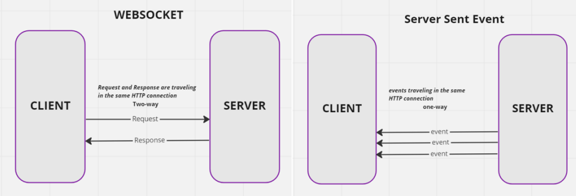
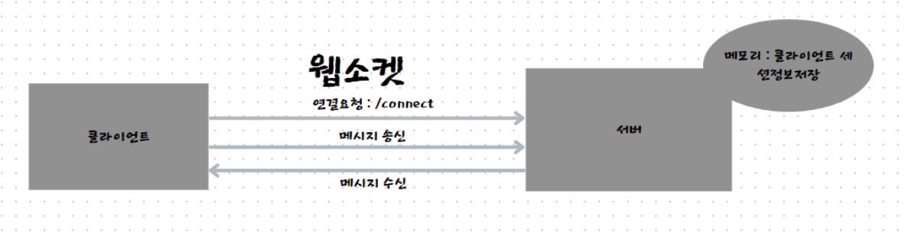
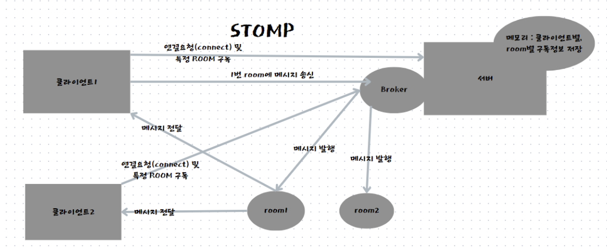
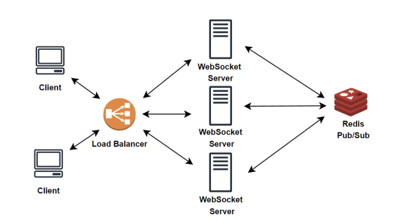

## websocket

 

### **http** vs **websocket**
- HTTP
  - 클라이언트 -> 서버로 request 요청
  - 서버 -> 클라이언트 response 응답
  - 클라이언트가 서버로 요청해야 서버가 응답하는 단방향 구조
  - 통신 프로토콜 : `http://`
- WebSocket
  - 클라이언트와 서버 간의 실시간 양방향 통신을 가능하게 하는 통신 프로토콜
  - 클라이언트 요청 없이도 서버에서 실시간으로 정보를 보내줌
    - http와 달리 서버가 사용자에 위치정보를 알기 때문에 가능
  - 통신 프로토콜 : `ws://`

 

### **http** vs **websocket** 연결 방식
- HTTP
  - TCP 프로토콜(양방향 프로토콜)
  - 비연결형 프로토콜로 매번 요청을 통해 **연결을 맺고 끊음**
    - 지속적 통신시 서버 부하
  - **http 메세지로 통신**
- Websocket
  - TCP 프로토콜(양방향 프로토콜)
  - 연결형 프로토콜로 최초 1번만 연결되면 Websocket 프로토콜로 업그레이드하여 **TCP 연결 유지**
    - 파이프라인이 만들어졌기 때문
  - **최초에 연결을 맺을때 HTTP 메세지**로 연결 요청

  

## Polling, SSE

 

### Polling, Websocket 비교
- polling
  - 프로토콜 X, 코딩 기법
  - 자바스크립트에서 몇초에 한번씩 자동으로 서버에 요청을 보내 업데이트를 확인하는 방식
  - 실시간으로 구현할 수 있지만 서버에 부담
- Websocket
  - 무거운 http 메세지 필요 없이 메세지를 주고 받음으로써 서버 부하 측면에서 우수

 

### SSE(Server Sent Event), Websocket 비교

- SSE
  - http 기반의 클라이언트와 서버 간의 실시간 단방향 통신을 가능하게 하는 웹 기술
  - 서버 -> 프론트엔드로 단방향 통신
  - 프론트 -> 서버 데이터 전송은 일반적인 HTTP통신
- Websocket
  - 서버 <-> 프론트 실시간 양방향 통신

  

## Stomp

 

### stomp, websocket 비교

일반 웹소켓

 

stomp

 

- stomp
  - WebSocket 위에서 동작하는 메세징 프로토콜
  - 목적지 기반 라우팅 지원
    - Broker를 활용하여 클라이언트와 서버가 특정 룸을 기준으로 메세지 교환
- websocket
  - 서버가 메세지를 받으면 연결된 클라이언트 모두에게 메세지 전달

 

### redis pub/sub을 통해 멀티서버 환경 고려

- 멀티 서버 환경에서는 메세지를 서버에 모두 전파해주는 redis pub/sub 기능 사용
- 메세지 발행, 구독 절차
  - 클라이언트는 송신할 메세지를 websocket server에 통신
  - websocket server는 해당 메세지를 곧바로 특정 topic에 메세지를 발행하지 않고, redis의 pub/sub 기능을 활용하여 메세리를 모든 서버에 publish
  - 모든 서버는 redis를 subscribe하고 있기에 redis로부터 발행된 message를 받아서, 본인 서버의 topic 메세지를 발행
  - 각 서버를 subscribe하고 있는 클라이언트들은 특정 room에 전파된 message를 수신

